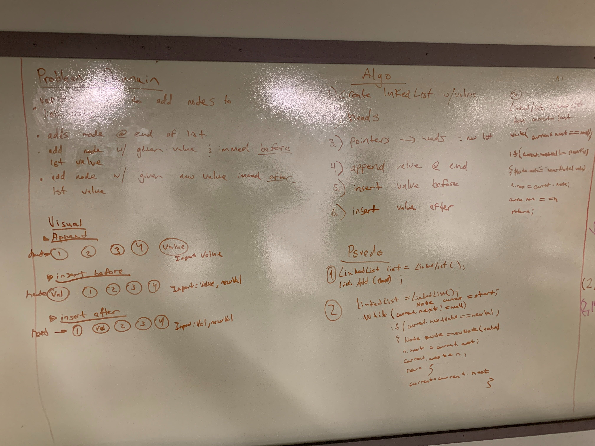
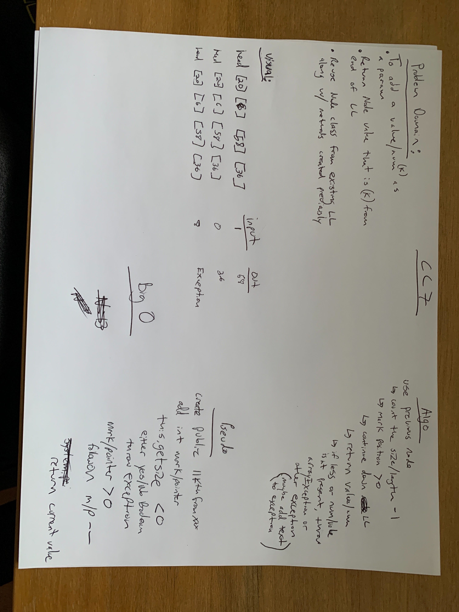
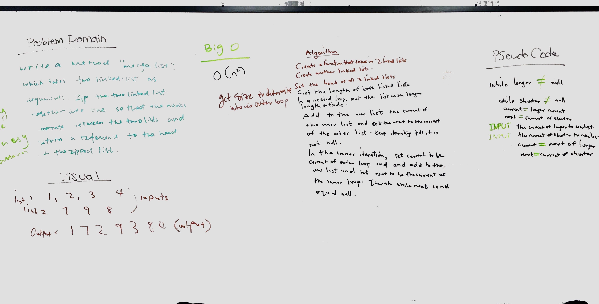

# data-structures-and-algorithms-301d60
# data-structures-and-algorithms-401-Java

# C 1
## Reverse an Array
Reverse it using a for loop.

## Challenge
Take in a Java Array and reverse it.

## Approach & Efficiency
The approach was completed by using a for-loop to iterate through the array and reverse it.

# Code Challenge 2
## Shift an Array
Using some simple math, determine if an array is even or odd, then place number at midpoint

## Challenge Description
Get a number to fit inside of an array at the midpoint

## Approach & Efficiency
My partner and I did some simple math in order to get an outside number into a midpoint of an array

## Solution

# Code Challenge 3
## Binary Search
Find a midpoint

## Challenge Description
Used a for-loop to in order to find a midpoint in an array

## Approach & Efficiency
Loop through arrays and found midpoint, took awhile but we figured it out. 

## Solution

# Singly Linked List
Created a node, pointer and LinkedList class

## Challenge
Get a node to point to the next LinkedList

## Approach & Efficiency
The approach I took was to first use online resources from csu.edu and stackoverflow. From there I used help from fellow classmates to help with the testing and string method

## API
ToString, IncludedInList, InsertHead. 
ToString was to get the data to go into a string
IncludedInList was the head data added
Insert Head was to create a new head from the pointer

# Code Challenge 6 (Greg and Serge)
## Shift an Array
Used 3 methods on a LinkedList called array, insertBefore, insertAfter to add values to the beginning and middle of array

## Challenge Description
Get a value to append and insert at various locations of LinkedList

## Approach & Efficiency
My partner and I created methods to append and insert values onto a LinkList and then from there we ran tests that are both true and false to ensure each portion worked

## Solution

# Code Challenge 7
## K-th value from the end of a linked list
Build a method that will find a specific point/mark in LL

## Challenge Description
Given an argument, find the number/value in LL and return value or throw an exception

## Approach & Efficiency
- Create int's for desired mark in LL
- Search LL for mark
- Create loop to search LL
- Greater than/ less than
- Return curr value
- Throw an exception (ArrayIndexOut/IndexOut)

## Solution

# Code Challenge 8
## MergeLists
Build a method called mergeLists that will merge two lists together

## Challenge Description
Given two LLists with values, merge them together based off of the values

## Approach & Efficiency
- Created a class
- Search lists for point to merge
- Create loop through and merge lists
- Greater than/ less than
- Return the merged list from the 2 incoming lists

## Solution

