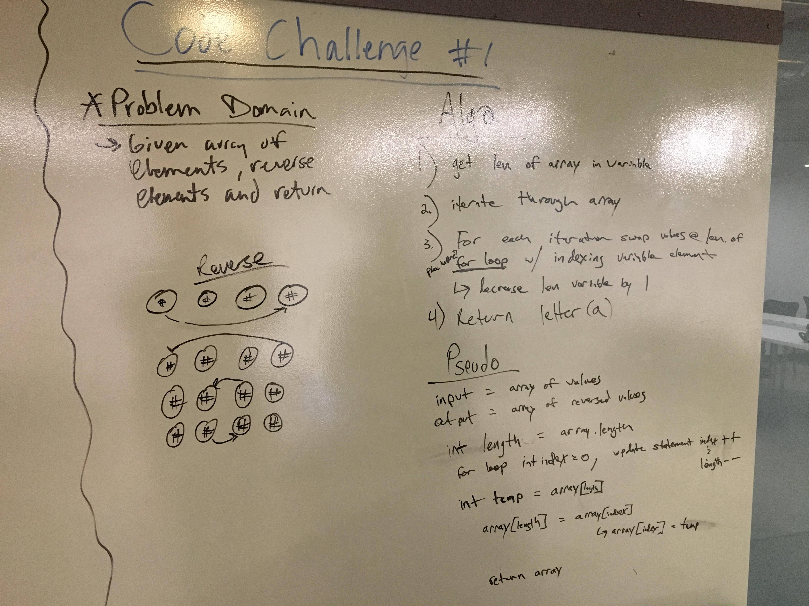
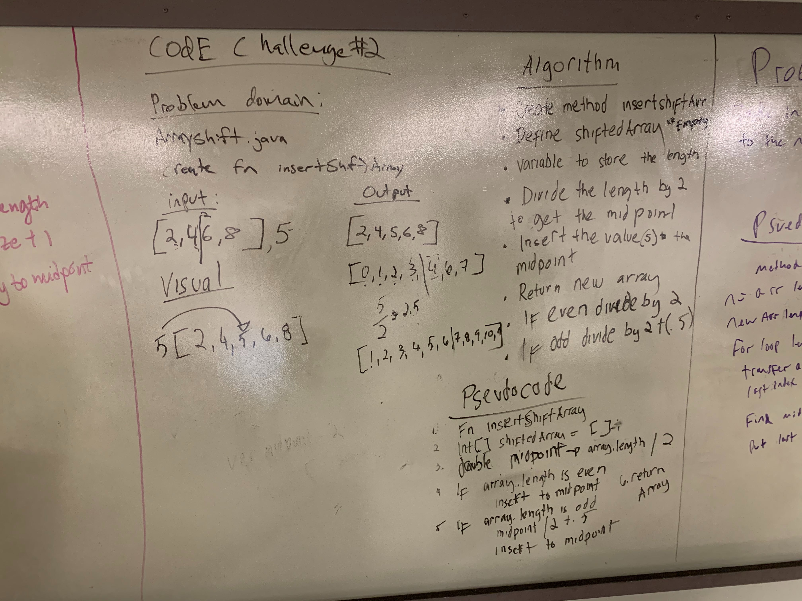
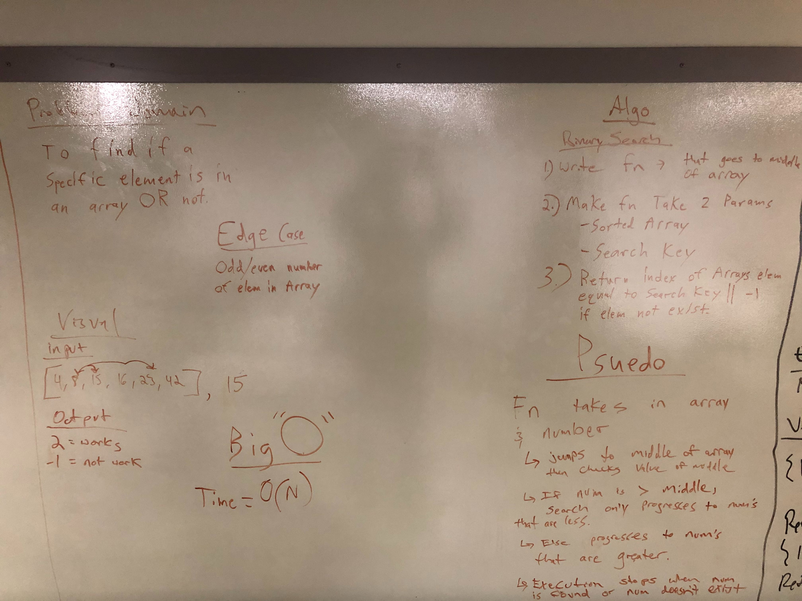

# data-structures-and-algorithms-301d60
# data-structures-and-algorithms-401-Java

# Lab 1
## Reverse an Array
Reverse it using a for loop.

## Challenge
Take in a Java Array and reverse it.

## Approach & Efficiency
The approach was completed by using a for-loop to iterate through the array and reverse it.

# Lab 2
## Shift an Array
Using some simple math, determine if an array is even or odd, then place number at midpoint

## Challenge Description
Get a number to fit inside of an array at the midpoint

## Approach & Efficiency
My partner and I did some simple math in order to get an outside number into a midpoint of an array

## Solution

# Lab 3
## Binary Search
Find a midpoint

## Challenge Description
Used a for-loop to in order to find a midpoint in an array

## Approach & Efficiency
Loop through arrays and found midpoint, took awhile but we figured it out. 

## Solution

